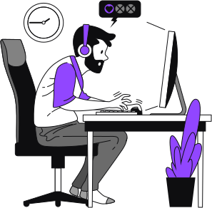

   

    

  

  

  

 

## 💡 Introduction

Mobile application made with React Native that connects with Twitch API

1. Sign In with Twitch
2. View all your Twitch online followed streams
3. View Twitch's most watched
4. Go to oficial Twitch's website by pressing images

 

## 🧪 Technologies

Technologies that were used on this application:

- [React](https://reactjs.org)
- [React Native](https://reactnative.dev/)
- [Expo](https://expo.dev/)

 

## 🔖 Layout

Check Figma Layout of this project [here](https://www.figma.com/file/3810p3gDrZUziuhZZ3MVZs/stream.data-Copy?fuid=1002364776444813494)

 

## 📝 License

MIT License © Yuri Paiva. Check [LICENSE](LICENSE) for more details

 

Made with 💜 &nbsp;by Yuri Paiva
